---
## Front matter
title: "Отчёт по лабораторной работе Архитектура компьютера"
subtitle: "Лабораторная работа №6"
author: "Дмитрий Алексеевич Митяков"
## Generic otions
lang: ru-RU
toc-title: "Содержание"

## Bibliography
bibliography: bib/cite.bib
csl: pandoc/csl/gost-r-7-0-5-2008-numeric.csl

## Pdf output format
toc: true # Table of contents
toc-depth: 2
lof: true # List of figures
lot: true # List of tables
fontsize: 12pt
linestretch: 1.5
papersize: a4
documentclass: scrreprt
## I18n polyglossia
polyglossia-lang:
  name: russian
  options:
	- spelling=modern
	- babelshorthands=true
polyglossia-otherlangs:
  name: english
## I18n babel
babel-lang: russian
babel-otherlangs: english
## Fonts
mainfont: PT Serif
romanfont: PT Serif
sansfont: PT Sans
monofont: PT Mono
mainfontoptions: Ligatures=TeX
romanfontoptions: Ligatures=TeX
sansfontoptions: Ligatures=TeX,Scale=MatchLowercase
monofontoptions: Scale=MatchLowercase,Scale=0.9
## Biblatex
biblatex: true
biblio-style: "gost-numeric"
biblatexoptions:
  - parentracker=true
  - backend=biber
  - hyperref=auto
  - language=auto
  - autolang=other*
  - citestyle=gost-numeric
## Pandoc-crossref LaTeX customization
figureTitle: "Рис."
tableTitle: "Таблица"
listingTitle: "Листинг"
lofTitle: "Список иллюстраций"
lotTitle: "Список таблиц"
lolTitle: "Листинги"
## Misc options
indent: true
header-includes:
  - \usepackage{indentfirst}
  - \usepackage{float} # keep figures where there are in the text
  - \floatplacement{figure}{H} # keep figures where there are in the text
---

# Цель работы

Освоение арифметических инструкций языка ассемблера NASM.

# Выполнение лабораторной работы

Я создал каталог для 6 лабораторной работы и в нем нужный файл (рис. @fig:001).
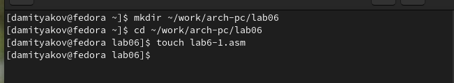{#fig:001 width=70%}
В этот файл скопировал код и в директорию скопировал файл in_out
(рис. @fig:002).
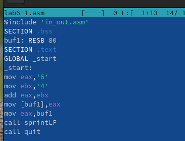{#fig:002 width=70%}
(рис. @fig:003).
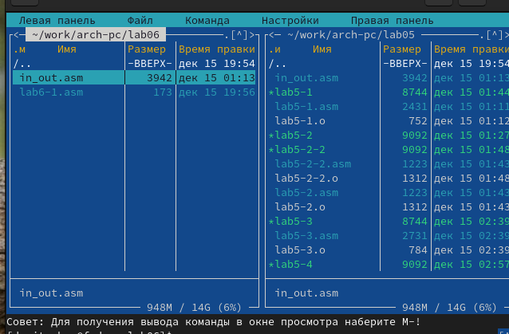{#fig:003 width=70%}
Создал исполняемый файл и получил такой результат
(рис. @fig:004).
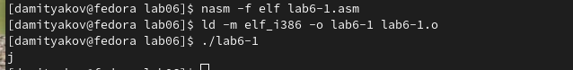{#fig:004 width=70%}
Затем изменил в исходном файле вместо символов записал в регистры числа
(рис. @fig:005).
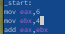{#fig:005 width=70%}
И получил такой результат - символ не отображается на экране
(рис. @fig:006).
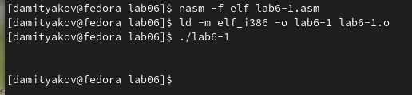{#fig:006 width=70%}
Создал следующий файл
(рис. @fig:007).
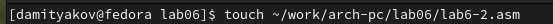{#fig:007 width=70%}
И скопировал туда уже новый текст
(рис. @fig:008).
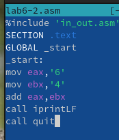{#fig:008 width=70%}
Исполняемый файл возвращает следующее значение
(рис. @fig:009).
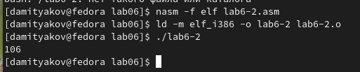{#fig:009 width=70%}
Заменяю символы на числа
(рис. @fig:010).
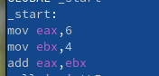{#fig:010 width=70%}
И получил такой результат
(рис. @fig:011).
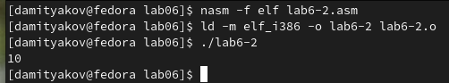{#fig:011 width=70%}
Создал еще один файл и вставил в него такой код, и после запуска получил результат:
(рис. @fig:012).
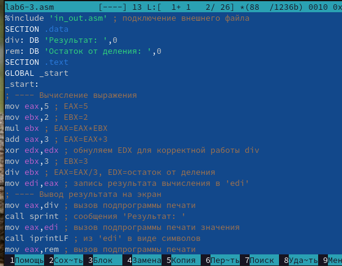{#fig:012 width=70%}
(рис. @fig:013).
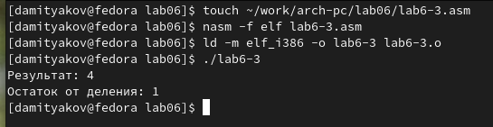{#fig:013 width=70%}
Изменил следующие строки и получил нужный результат
(рис. @fig:014).
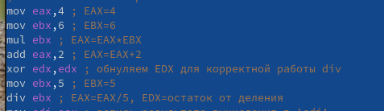{#fig:014 width=70%}
(рис. @fig:015).
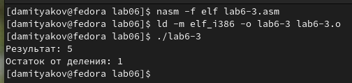{#fig:015 width=70%}
Получил номер варианта с помощью программы:
(рис. @fig:016).
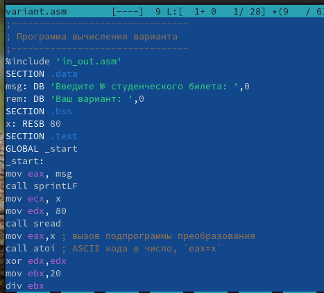{#fig:016 width=70%}
Мой вариант - 8
(рис. @fig:017).
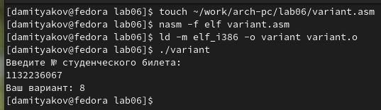{#fig:017 width=70%}
(рис. @fig:018).
-
1.За вывод сообщения “Ваш вариант” отвечают строки кода:
mov eax,rem
call sprint
2.Инструкция mov ecx, x используется, чтобы положить адрес вводимой строки x в регистр ecx mov edx, 80 - запись в регистр edx длины вводимой строки call sread - вызов подпрограммы из внешнего файла, обеспечивающей ввод сообщения с клавиатуры
3.call atoi используется для вызова подпрограммы из внешнего файла, которая преобразует ascii-код символа в целое число и записывает результат в регистр eax
4.За вычисления варианта отвечают строки:
xor edx,edx ; обнуление edx для корректной работы div
mov ebx,20 ; ebx = 20
div ebx ; eax = eax/20, edx - остаток от деления
inc edx ; edx = edx + 1
5.При выполнении инструкции div ebx остаток от деления записывается в регистр edx
6.Инструкция inc edx увеличивает значение регистра edx на 1
7.За вывод на экран результатов вычислений отвечают строки:

# Задания для самостоятельной работы 
Написал код программы, описывающий вычисление результата функции 8 варианта
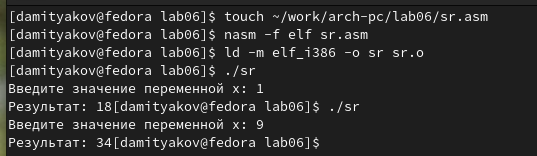{#fig:018 width=70%}
(рис. @fig:019).
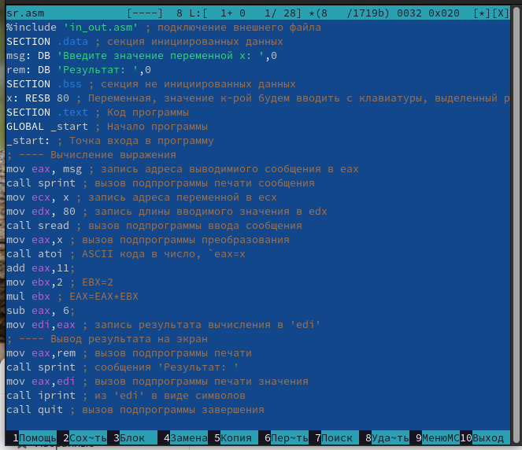{#fig:019 width=70%}

# Выводы

Я освоил арифметические инструкции языка ассемблера NASM.

# Список литературы{.unnumbered}

::: {#refs}
:::
