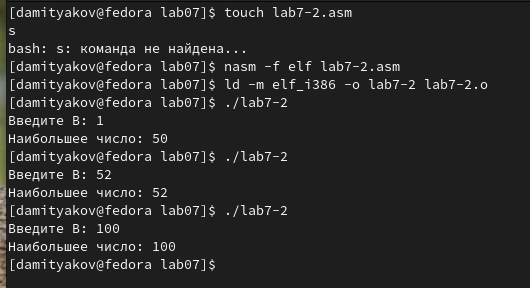

---
## Front matter
title: "Отчёт по лабораторной работе Архитектура компьютера"
subtitle: "Лабораторная работа №7"
author: "Дмитрий Алексеевич Митяков"
## Generic otions
lang: ru-RU
toc-title: "Содержание"

## Bibliography
bibliography: bib/cite.bib
csl: pandoc/csl/gost-r-7-0-5-2008-numeric.csl

## Pdf output format
toc: true # Table of contents
toc-depth: 2
lof: true # List of figures
lot: true # List of tables
fontsize: 12pt
linestretch: 1.5
papersize: a4
documentclass: scrreprt
## I18n polyglossia
polyglossia-lang:
  name: russian
  options:
	- spelling=modern
	- babelshorthands=true
polyglossia-otherlangs:
  name: english
## I18n babel
babel-lang: russian
babel-otherlangs: english
## Fonts
mainfont: PT Serif
romanfont: PT Serif
sansfont: PT Sans
monofont: PT Mono
mainfontoptions: Ligatures=TeX
romanfontoptions: Ligatures=TeX
sansfontoptions: Ligatures=TeX,Scale=MatchLowercase
monofontoptions: Scale=MatchLowercase,Scale=0.9
## Biblatex
biblatex: true
biblio-style: "gost-numeric"
biblatexoptions:
  - parentracker=true
  - backend=biber
  - hyperref=auto
  - language=auto
  - autolang=other*
  - citestyle=gost-numeric
## Pandoc-crossref LaTeX customization
figureTitle: "Рис."
tableTitle: "Таблица"
listingTitle: "Листинг"
lofTitle: "Список иллюстраций"
lotTitle: "Список таблиц"
lolTitle: "Листинги"
## Misc options
indent: true
header-includes:
  - \usepackage{indentfirst}
  - \usepackage{float} # keep figures where there are in the text
  - \floatplacement{figure}{H} # keep figures where there are in the text
---

# Цель работы

Изучение команд условного и безусловного переходов. Приобретение навыков написания
программ с использованием переходов. Знакомство с назначением и структурой файла
листинга.

# Выполнение лабораторной работы

Я создал нужную директиву и необходимый файл
(рис. @fig:001).
{#fig:001 width=70%}
В этот файл вставил код из листинга
(рис. @fig:002).
{#fig:002 width=70%}
И получил такой результат
(рис. @fig:003).
{#fig:003 width=70%}
Вставил код из другого листинга
(рис. @fig:004).
{#fig:004 width=70%}
И получил новый результат
(рис. @fig:005).
{#fig:005 width=70%}
Поменял код на этот
(рис. @fig:006).
{#fig:006 width=70%}
Получив необходимый результат
(рис. @fig:007).
{#fig:007 width=70%}
Создал новый файл и вставил туда новый код
(рис. @fig:008).
{#fig:008 width=70%}
Получил такие результаты попробовав несколько вводимых значений
(рис. @fig:009).
{#fig:009 width=70%}
Открыл файл листинга и обнаружил там следующие 3 строки:
1 - номер строки
2 - адрес в памяти
3 - машинный код
4 - исходный текст программы
5 - комментарий (часть исходного текста команды)
(рис. @fig:010).
1{#fig:010 width=70%}
Убрал один операнд из команды 
(рис. @fig:011).
{#fig:011 width=70%}
И получил такой результат в листинге
(рис. @fig:012).
{#fig:012 width=70%}

Поменял проверку флага jg на jl в коде нахождения максимального числа и некоторые строки и получил программу на нахождение минимального числа
(рис. @fig:014).
{#fig:014 width=70%}
(рис. @fig:015).
{#fig:015 width=70%}
Написал программу нахождения результата функции
(рис. @fig:016).
{#fig:016 width=70%}
(рис. @fig:017).
{#fig:017 width=70%}

# Выводы

Я изучил команды условного и безусловного переходов. Приобретел навыки написания
программ с использованием переходов. Познакомился с назначением и структурой файла
листинга.

# Список литературы{.unnumbered}

::: {#refs}
:::
